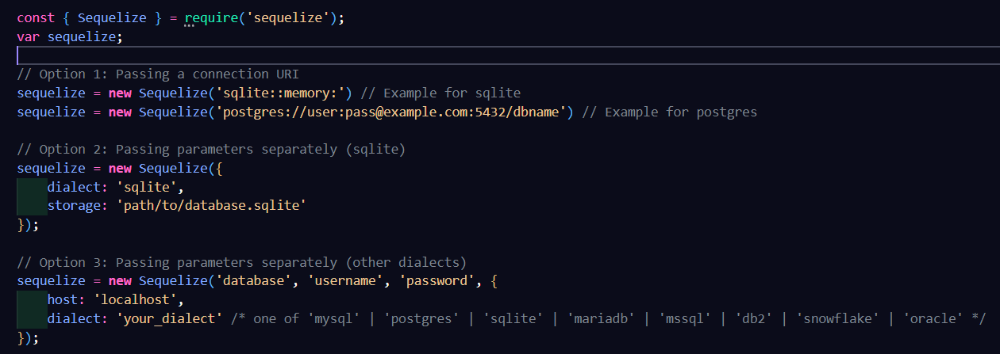
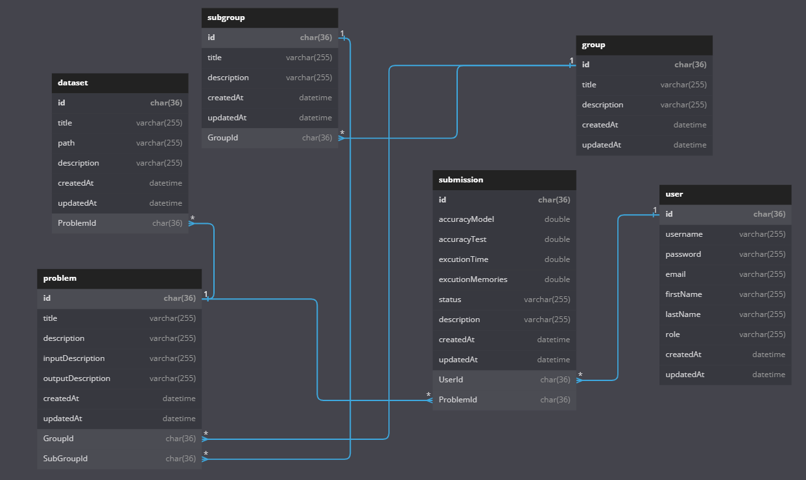

# AI Evaluation

## 1, About

- Evaluate accuracy of AI models.
- Nodejs, Expressjs, Reactjs, Material UI,...

## 2, Install libraries

Run command **```npm install```** to install all libraries used in this project.

## 3, Error code

- ```200```: **```OK. No errors occurred.```**.
- ```400```: **```Error. Missing input(s) values.```**.
- ```400```: **```Error. Duplicate infomations.```**.
- ```401```: **```Error. Unauthenticated.```**.
- ```403```: **```Error. Forbidden.```**.
- ```404```: **```Error. Infomation(s) not found.```**.
- ```500```: **```Error.```**.

## 4, Setup database

- Create a blank database.
- Update your database infomations in 2 files **```src/config/connectDB.js```**, **```src/models/index.js```**.

- Run the command **```node src/config/setupDB```** to create all tables in database.
- Database E-R diagram:
- Enities:
  - ```User``` : Infomations of user, has role: **```admin```**, **```user```**, **```superAdmin```**.
  - ```Problem``` : Infomations of problems.
  - ```Group``` : Type of problems.
  - ```SubGroup``` : Small problem types in each groups.
  - ```Submission``` : Log the infomations of each submission.
  - ```Dataset``` : Dataset was used each problem.

## 5, Run project

- **```npm start```**: Run project with hot reload.
- **```npm run format```**: Format the project with the structure described in file **```package.json```**.
- **```npm run dev```**: Format + run project with hot reload.
