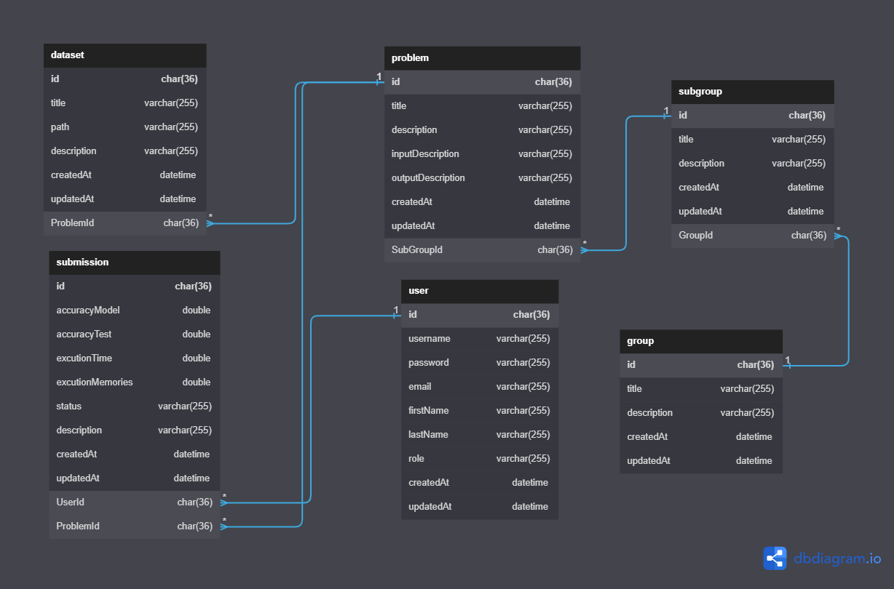

# AI Evaluation

## 1, About

- Evaluate accuracy of AI models
- Nodejs, Expressjs, Reactjs, Material UI,...

## 2, Install libraries

Run command **```npm install```** to install all libraries used in this project

## 3, Setup

### 3.1, Environment variables

- Create a file **```.env```** in the root folder
- Copy all content of **```.env.example```** to **```.env```**
- Define values for all environment variables:
  - Project environment:
    - **```PORT```**: Port number of server. Default is **```5000```**
    - **```NODE_ENV```**: Environment mode. Default is **```development```**
  - Database:
    - **```DB_HOST```**: Database host. Default: **```localhost```**
    - **```DB_USER```**: Database username.
    - **```DB_PASSWORD```**: Password of **```DB_USER```**.
    - **```DB_NAME```**: Database name. Default: **```ai_evaluation_dev```**
  - JWT Key: You can create your own key or run command **```npm run key```** to generate random keys
    - **```JWT_ACCESS_KEY```**: Access key for JWT.
    - **```JWT_REFRESH_KEY```**: Refresh key for JWT.

### 3.2, Database

- Create a blank database with the name that you defined in file **```.env```**
- Run the command **```npm run setupdb```** to create all tables in database
- Database E-R diagram:
- Enities:
  - ```User``` : Infomations of user, has role: **```admin```**, **```user```**, **```superAdmin```**
  - ```Problem``` : Infomations of problems
  - ```Group``` : Type of problems
  - ```SubGroup``` : Small problem types in each groups
  - ```Submission``` : Log the infomations of each submission
  - ```Dataset``` : Dataset was used each problem

> You can use the example data in file **```./assets/ai_evaluation_dev.sql```** to test the project
> Password of all user is **123456**

## 4, Run project

- **```npm start```**: Run project with hot reload
- **```npm run format```**: Format the project with the structure described in file **```package.json```**
- **```npm run dev```**: Format + run project with hot reload

> On the first run, you need to create a user with role **```superadmin```** to manage the system. You can use the API **```POST /api/v1/auth/register```** to create an account with role **```user```**. Then, you can update the role of this user to **```superadmin```** in the database. If you use the example data, you can skip this step.
>
> Next, you can use the API **```POST /api/v1/auth/login```** to get the access token and refresh token. You can use the access token to access the APIs that need authentication. You can use the refresh token to get a new access token when the access token is expired
>
> Now, you can use the system by accessing the APIs that I described in the next section

## 5, Error code

- ```200```: **```OK. No errors occurred.```**
- ```400```: **```Error. Missing input(s) values.```**
- ```400```: **```Error. Duplicated infomations.```**
- ```401```: **```Error. Unauthenticated.```**
- ```403```: **```Error. Forbidden.```**
- ```404```: **```Error. Infomation(s) not found.```**
- ```500```: **```Error. Something went wrong```**

## 6, APIs

> ***```User+```: Need to be a user or higher***
>
> ***```Admin+```: Need to be an administrator or higher***
>
> ***```Superadmin```: Need to be a super administrator***

---------

> With the body of the request, you can see that they are divided into 2 cases:
> **```Bold```** for required fields
> ```Normal``` for omitable fields

### 6.1, Authentication, authorization

| Authorization | Method | URL | Body | Description |
| ----------- | ----------- | ----------- | ----------- | ----------- |
| **None** | **POST** | **```/api/v1/auth/register```** | **```username```: *string*** <br/> **```password```: *string*** <br/> **```email```: *string*** <br/> **```firstName```: *string*** <br/> **```lastName```: *string*** | Register |
| **None** | **POST** | **```/api/v1/auth/login```** | **```username```: *string*** <br/> **```password```: *string*** | Login |

### 6.2, User, admin, superadmin

#### 6.2.1, User

| Authorization | Method | URL | Body | Description |
| ----------- | ----------- | ----------- | ----------- | ----------- |
| **Admin+** | **POST** | **```/api/v1/users/add```** | **```username```: *string*** <br/> **```password```: *string*** <br/> **```email```: *string*** <br/> **```firstName```: *string*** <br/> **```lastName```: *string*** | Add new user |
| **User+** | **DELETE** | **```/api/v1/users/delete/:userId```** | None | Delete user by id |
| **User+** | **PUT** | **```/api/v1/users/edit/:userId```** | **```password```: *string*** <br/> **```email```: *string*** <br/> **```firstName```: *string*** <br/> **```lastName```: *string*** | Update user by id |
| **User+** | **GET** | **```/api/v1/users/:userId```** | None | Get user by id |
| **Admin+** | **GET** | **```/api/v1/users```** | None | Get all users |

#### 6.2.2, Admin

| Authorization | Method | URL | Body | Description |
| ----------- | ----------- | ----------- | ----------- | ----------- |
| **Superadmin** | **POST** | **```/api/v1/admins/add```** | **```username```: *string*** <br/> **```password```: *string*** <br/> **```email```: *string*** <br/> **```firstName```: *string*** <br/> **```lastName```: *string*** | Add new admin |
| **Admin+** | **DELETE** | **```/api/v1/admins/delete/:userId```** | None | Delete admin by id |
| **Admin+** | **PUT** | **```/api/v1/admins/edit/:userId```** | **```password```: *string*** <br/> **```email```: *string*** <br/> **```firstName```: *string*** <br/> **```lastName```: *string*** | Update admin by id |
| **Admin+** | **GET** | **```/api/v1/admins/:userId```** | None | Get admin by id |
| **Superadmin** | **GET** | **```/api/v1/admins```** | None | Get all admins |

#### 6.2.3, Superadmin

| Authorization | Method | URL | Body | Description |
| ----------- | ----------- | ----------- | ----------- | ----------- |
| **Superadmin** | **GET** | **```/api/v1/superadmins/:userId```** | None | Get superadmin by id |
| **Superadmin** | **PUT** | **```/api/v1/superadmins/edit/:userId```** | **```password```: *string*** <br/> **```email```: *string*** <br/> **```firstName```: *string*** <br/> **```lastName```: *string*** | Update superadmin by id |

### 6.3, Problem

| Authorization | Method | URL | Body | Description |
| ----------- | ----------- | ----------- | ----------- | ----------- |
| **Admin+** | **POST** | **```/api/v1/problems/add```** | **```title```: *string*** <br/> **```description```: *string*** <br/> **```inputDescription```: *string*** <br/> **```outputDescription```: *string*** <br/> **```subGroupId```: *string*** | Add new problem |
| **Admin+** | **DELETE** | **```/api/v1/problems/delete/:problemId```** | None | Delete problem by id |
| **Admin+** | **PUT** | **```/api/v1/problems/edit/:problemId```** | **```title```: *string*** <br/> **```description```: *string*** <br/> **```inputDescription```: *string*** <br/> **```outputDescription```: *string*** <br/> **```subGroupId```: *string*** | Update problem by id |
| **User+** | **GET** | **```/api/v1/problems/groups/subgroups/:subGroupId```** | None | Get all problems by subGroup id |
| **User+** | **GET** | **```/api/v1/problems/groups/:groupId```** | None | Get all problems by group id |
| **User+** | **GET** | **```/api/v1/problems/:problemId```** | None | Get problem by id |
| **User+** | **GET** | **```/api/v1/problems```** | None | Get all problems |

### 6.4, Dataset

| Authorization | Method | URL | Body | Description |
| ----------- | ----------- | ----------- | ----------- | ----------- |
| **Admin+** | **POST** | **```/api/v1/datas/add```** | **```title```: *string*** <br/> **```path```: *string*** <br/> ```description```: *string* <br/> **```problemId```: *string*** | Add new dataset. |
| **Admin+** | **DELETE** | **```/api/v1/datas/delete/datasetId```** | None | Delete dataset by id |
| **Admin+** | **PUT** | **```/api/v1/datas/edit/datasetId```** | **```title```: *string*** <br/> **```path```: *string*** <br/> ```description```: *string* <br/> **```problemId```: *string*** | Update dataset by id |
| **User+** | **GET** | **```/api/v1/datas/groups/subgroups/:subGroupId```** | None | Get all datasets by group and subGroup id |
| **User+** | **GET** | **```/api/v1/datas/groups/:groupId```** | None | Get all datasets by group id |
| **User+** | **GET** | **```/api/v1/datas/problems/:problemId```** | None | Get all datasets by problem id |
| **User+** | **GET** | **```/api/v1/datas/:datasetId```** | None | Get dataset by id |
| **User+** | **GET** | **```/api/v1/datas```** | None | Get all datasets |

### 6.5, Group, SubGroup

| Authorization | Method | URL | Body | Description |
| ----------- | ----------- | ----------- | ----------- | ----------- |
| **Admin+** | **POST** | **```/api/v1/groups/add```** | **```title```: *string*** <br/> ```description```: *string* | Add new group |
| **Admin+** | **DELETE** | **```/api/v1/groups/delete/:groupId```** | None | Delete group by id |
| **Admin+** | **PUT** | **```/api/v1/groups/edit/:groupId```** | **```title```: *string*** <br/> ```description```: *string* | Update group by id |
| **Admin+** | **POST** | **```/api/v1/groups/subgroups/add```** | **```title```: *string*** <br/> ```description```: *string* <br/> **```groupId```: *string*** | Add new subGroup |
| **Admin+** | **DELETE** | **```/api/v1/groups/subgroups/delete/:subGroupId```** | None | Delete subGroup by group and id |
| **Admin+** | **PUT** | **```/api/v1/groups/subgroups/edit/:subGroupId```** | **```title```: *string*** <br/> ```description```: *string* <br/> **```groupId```: *string*** | Update subGroup by group and id |
| **User+** | **GET** | **```/api/v1/groups/subgroups/:subGroupId```** | None | Get subGroup by group and id |
| **User+** | **GET** | **```/api/v1/groups/subgroups```** | None | Get all subGroups |
| **User+** | **GET** | **```/api/v1/groups/:groupId```** | None | Get group by id |
| **User+** | **GET** | **```/api/v1/groups```** | None | Get all groups |

### 6.6, Submission

| Authorization | Method | URL | Body | Description |
| ----------- | ----------- | ----------- | ----------- | ----------- |
| **User+** | **POST** | **```/api/v1/submissions/add```** | ```accuracyModel```: *double* <br/> ```accuracyTest```: *double* <br/> ```excutionTime```: *double* <br/> ```excutionMemories```: *double* <br/> ```status```: *string* <br/> ```description```: *string* <br/> **```userId```: *string*** <br/> **```problemId```: *string*** | Add new submission |
| **Admin+** | **DELETE** | **```/api/v1/submissions/delete/:submissionId```** | None | Delete submission by id |
| **User+** | **PUT** | **```/api/v1/submissions/edit/:submissionId```** | ```accuracyModel```: *double* <br/> ```accuracyTest```: *double* <br/> ```excutionTime```: *double* <br/> ```excutionMemories```: *double* <br/> ```status```: *string* <br/> ```description```: *string* <br/> **```userId```: *string*** <br/> **```problemId```: *string*** | Update submission by id |
| **Admin+** | **GET** | **```/api/v1/submissions/groups/subgroups/:subGroupId```** | None | Get all submissions by subGroup id |
| **Admin+** | **GET** | **```/api/v1/submissions/groups/:groupId```** | None | Get all submissions by group id |
| **Admin+** | **GET** | **```/api/v1/submissions/problems/:problemId```** | None | Get all submissions by problem id |
| **User+** | **GET** | **```/api/v1/submissions/problems/:problemId/users/:userId```** | None | Get all submissions by problem id and user id |
| **User+** | **GET** | **```/api/v1/submissions/users/:userId```** | None | Get all submissions by user id |
| **User+** | **GET** | **```/api/v1/submissions/:submissionId```** | None | Get submission by id |
| **Admin+** | **GET** | **```/api/v1/submissions```** | None | Get all submission |
